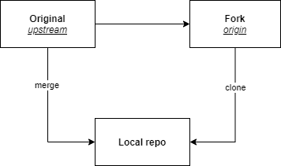

How to update a forked repo and get the last updates from the original project?

### Short answer

On your local CLI of the forked project, link the repo to the original project, fetch changes, do a merge, and finally push to your GitHub repo.

### Long answer  

We can update a forked git repository using one of the many GUIs for git, but we will do it in CLI. 

First under your repository directory:

Shows URLs of remote repositories when listing your current remote connections: 

Enter a remote *upstream* repo to sync with your fork:

Verify:

Fetch commits from the upstream repo. This will copy the commits from `master` branch into a local branch called `upstream/master`:

Merge changes from `upstream/master` into `master`:

Push changes to your repo:

### Reference

 https://rick.cogley.info/post/update-your-forked-repository-directly-on-github 