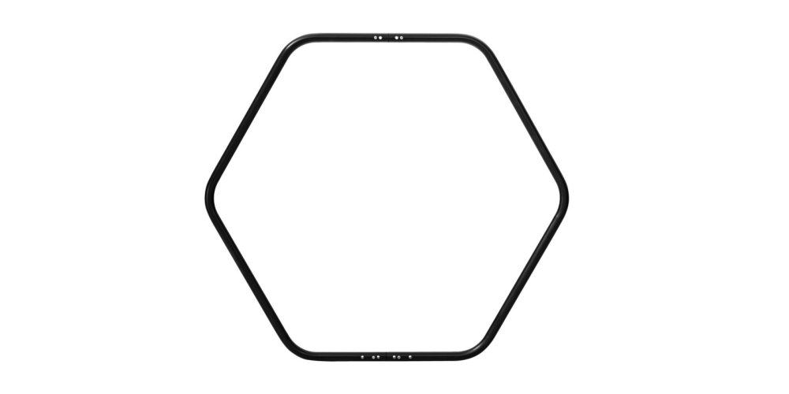
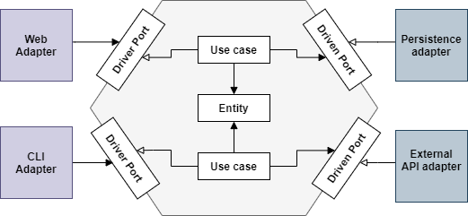

In this article, we'll talk about Hexagonal Architecture, and we’ll build a Java app to illustrate its concepts.

*tl;dr*

Throughout my experience, I worked on some projects where the business logic and the technical code (code generators, repositories, factories, de/serializers, mappers, proxies, pools, persistence, etc.) were shared/mixed across layers and modules (without mentioning the responsibilities of each part of code because it is another problem to talk about). To sum up, there was no clean/ clear separation of concerns. Each code change was painful & everybody was running away from these projects or companies. The key to a successful layered architecture is to have the business logic decoupled from all other concerns like the infrastructure and technical components. To achieve this on a similar messy project, inversion of control is one of the best practices that can save you. I am sure that you have used the inversion of control before. Another pattern that can save you too because it promotes decoupling from technology and frameworks is Ports and Adapters. If you are thinking isn’t the pattern too old? How is it that it is still worth it nowadays? Well, good things are timeless. The main idea of Ports & Adapters is to define the structure of an application so that it could be run by different kinds of clients (humans, test cases, applications, etc.). Ports and adapters are analogous to exposing multiple USB ports on a machine. If you have the best adapter of a keyboard/ mouse that fits into your machine’s port, you’ll be able to reach your goal. If you have a keyboard with an incompatible adapter you will not be able to plug your keyboard and, I am sure you will not damage the ports either the machine. That is the main idea of this pattern! Ports & Adapters represents the application as a closed space, and this is the same case for the computer. Again, you will not break its ports to plug an incompatible device. This closed area, chosen by Alistair Cockburn for drawing the application, was a hexagon and, it has also led to something called Hexagonal Architecture. 

The rest of this text is to present my approach of implementing an application in the hexagonal style with Java.

## 1. What/ Why Hexagonal Architecture?

Hexagonal architecture, or ports and adapters pattern is an architectural style that **focuses on preserving the business logic decoupled from external concerns and secured inside the hexagon**. There are no layers. As opposed to the common layered architecture style, the components outside the hexagon point towards the objects inside the hexagon. In other words, dependencies are going from user-side and server-side to the business logic.

The hexagon is just a way to describe the final system that is made up of (the business logic .i.e domain model and ports) the inside-part, and (adapters) the outside-part.

The value of an application resides in its domain and use cases. So isolating and securing this space is mandatory. Tech stacks come and go but the business will still the same. As an example, people have used and will continue to add products in the basket before going to the checkout page on an e-Commerce website. 

Uncle Bob said the essence of an application is not in its DB and frameworks. Particularly, use cases are the central element, and everything should orbit around it. Therefore, Alistair Cockburn's vision completes what has stated before where an application could be driven by users at first, and machines at a second time. If your legacy is SOAP exposes SOAP, and you have an isolated business layer so you will be able to do REST easily. 

## 2. Principles

As we said before and again, hexagonal architecture aims to isolate the business logic and make it accessible via abstractions called ports and implementations called adapters. Then the code of the application is divided into two large formalized parts:

- The inside-part = the hexagon = the business core: 
  - Domain model: Domain model or entities can hold both state and behavior. They’re **pure Java objects** (POJOs) and do not contain any annotation or external dependency (no serialization, no code generation, no tricks). While writing the code, we follow the spontaneous flow of dependencies: we begin coding and evolving in the domain model, and then we go outside.
  
  - Ports: Communications to and from the outside occurs through “ports”. We can distinguish two types of ports. A **driver port** is a contract that can be invoked by an outsider component. 
  
    > In Java, interfaces are ports. 
  
    **A driver port** is implemented by a use case. The driver adapter will use this port to invoke the features inside the business core. 
  
    > In Java, implementations are adapters. 
  
    **A driven port** is a contract that can be invoked by a use case and it is implemented by an outsider component. This contract is designed to fit the needs of the use cases. 
  
    The **Inversion of Control** is a powerful tool to replace the implementations without having to modify the hexagon.
  
  - Use cases: It is a class that controls everything inside the hexagon. It is an explicitly defined way in which an application can be used. In a layered architecture, it is a service class. A use case could be "restore a forgotten password": in Java, it would be `RestoreForgottenPasswordUseCase`. Alike the domain model, use cases have no dependency outside the hexagon. I declare itself available for usage outside through the driver port and it uses the driven adapter which implements the driven port. 
- The outside: 
  
  - Adapters: the adapters are the implementation of ports. As we saw up, we have driven and driver ports and also driven and driver adapters. An adapter can implement multiple ports. The adapters make it easy to switch a part of the application. Do you want to switch to a different framework? Write a new adapter. Do you want to use a NoSQL, instead of storing data in files? Again, write an adapter for it.

## 3. Hands on

Now, we'll try to apply these principles and build a weather App to store and notify users about temperature. 

### 3.1. Domain

Let’s begin with our domain class called Temperature:

The domain model should have no link or dependency on any specific technology such as annotations from Lombok. 

### 3.2. Ports

We'll introduce some ports to interact with outside world and provide the business logic of system. First, let’s define the driver port to interact with our application: 

Similarly, we’ll also write two driven ports to interact with the database and the notification system:

### 3.3. The use case

Next, we'll create a use case and join all the pieces together to manage the execution by implementing the driver port:

### 3.4. Adapters

To accomplish our use case, we provided an in-memory implementation of the driven ports: 

For each adapter, we provided objects to use and mappers to ensure the conversion of objects from domain object to the infrastructure. 

### 3.5. App bootstrap

In our case, we will expose the weather app through a REST API. This class `UpdateTemperatureResource` represents the App. It instantiates objects for each adapter and injects instantiated dependencies. To keep things simple, we didn't used CDI annotations but we can use them only on *infrastructure* and *app* <u>packages</u>. The domain MUST stay technology *agnostic*.  

The structure of the project ends up looking like: 

The weather app can be exposed over a REST API, scheduled jobs or CLI. So our application could be be driven by users at first, and machines at a second time.

To keep things simple, we kept all the code the inside and the outside parts of code in the same project but separated in different packages. 

The benefit of hexagonal is that it is more modular, so you have a clear separation of components, preventing the leaking of code between them. In real world example, the domain (model, ports, use cases) must go in go sperate module and each adapter (db, file system, etc.) must go in a separate module. 

### 5. Observations

You can find other naming conventions for ports, adapter, and domain. 

- driven port = in port = inbound port = left = SPI
- driver port = out port = outbound port = right = API
- business logic = domain = core

Interfaces, in general, allow you to decouple implementation from the component that uses it, following the [Dependency Inversion Principle](https://martinfowler.com/articles/dipInTheWild.html). This way, instead of high-level modules (domain) depending on low-level modules (adapters), both will depend on abstractions.

Extendibility, following the Open-closed Principle. Adding another implementation, such as an adapter for `OpenWeather`, does not require modifying the domain code.

### 6. Conclusion

In this article, we’ve seen how to implement an application using Hexagonal Architecture in Java. The code is available over on [GitHub](https://github.com/alibenmessaoud/ha-bapp).

### 7. References

- [Get Your Hands Dirty on Clean Architecture, Tom Hombergs](https://www.packtpub.com/programming/get-your-hands-dirty-on-clean-architecture) 
- [Happy Town, Céline Gilet](https://github.com/celinegilet/happy-town) 